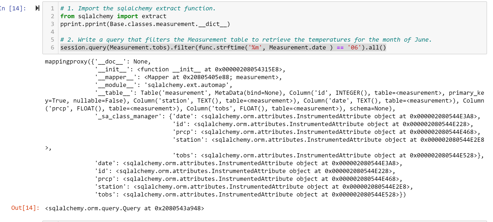
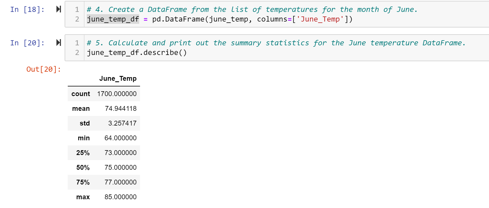
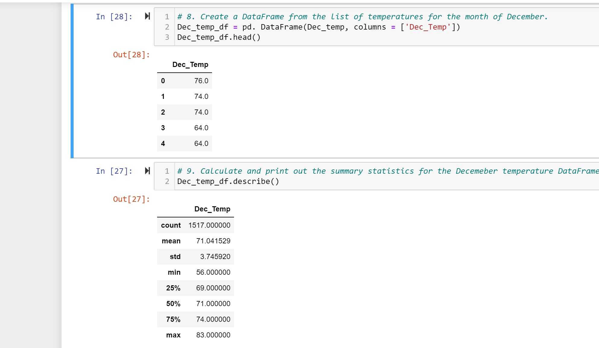

# surfs_up

# Overview of the analysis 

The analysis was done to help an investor with decision making about investing in a start up business on
an Island. The Investor would like to know the weather reports in the Oahu Island which is a potential 
determinig factor on the customers to expect all year round.

We analyzed precipitation levels and showed the cold, hard, data that backs up Oahu as the perfect place to surf.

We also analyzed temperature levels to show the high, low and average temparatures to show how the ice cream sales is projeted to be.

Since there is a possibility of investing in another surf and ice cream shop, we want a repeatable process and easier  analysis for subsequent times, we saved our sorted results to a Python Pandas DataFrame.

It is important to show professionalism and save the investor the stress of reading over a bunch of data, we showed the weather patterns of a specific location on Oahu using visualization.

To give a summary of the result, we did statistical analysis for the data.

The efficiency  of our data collection was tested by running a query to get the number of stations and the most active of the stations, where the precipitation data was collected.

We incorporated ***Flask*** into the data analysis to display our results in a webpage. All the board of directors (who may not be interested in the code or raw data) needs to access the same information we have provided is the URL.

We created the appropriate routes for all the analysis for easy access to specific data and information

## Results: 

- Printed out the all the columns in the table

- SHowing a summary of statistics of temperature measurement for the month of June

- Showing the temperature measurement for the month of December saved in a dataframe and the summary of statistics

## Summary: 

The summary statistics shows that there is no much difference in the temperature of Oahu in June (Summer) and December (Winter). June has a high and low of 85  and 64 while December has a higha nd low of 83 and 56 respectively. The average temperature is also closely related 74 and 71 for June and December respectuvely. This shows that seasonal changes will likely not affect the influx of customers to Oahu as such there will be constant demand for surf and ice cream.

Other queries that can be check include:

Getting the precipation in the last 12 months
precipitation_data = session.query(Measurement.prcp).filter(Measurement.date >= prev_year)

Getting the number of available stations for the analysis
stations_available = session.query(func.count(Station.station)).all()